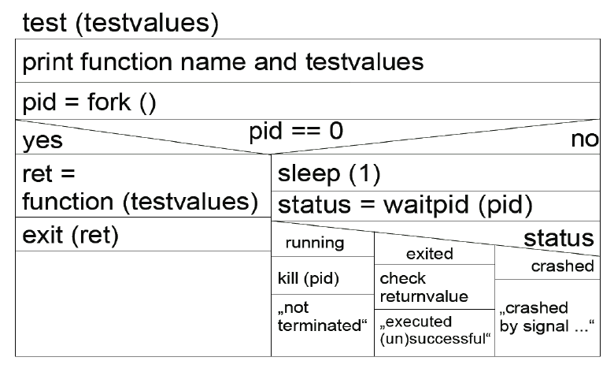

# Testing Library Robustness

This task can only be solved with Unix or Linux. You have to implement a robustness test for the
glibc function `fputs`. The robustness is tested for common and uncommon argument values of that
function.

# 1. Background

## 1.1. The robustness problem

All real applications have to behave robust. This means there are general requirements for unspecified inputs:
* "do not crash"
* "do not lose consistency"
* ...

In other words, the program shall not crash or come into an inconsistent state or face any other
problems only because it has been fed with an unexpected input.

Developers might be forced to use some libraries, with unknown robustness. The source code is often not accessible, so source code inspection is not an option. Developers need another approach to "measure" the robustness of libraries. This is the topic of the current task.

In this task, we will concentrate on finding bugs, not fixing them.
Dealing with non-robust libraries by introducing a patching wrapper will be investigated in the next task.

## 1.2. Finding robustness bugs

Robustness is commonly determined per module. For libraries modules are exported functions. To
measure a library's robustness, the robustness of each exported function must be determined.

In theory a function must be tested against each possible combination of input values. In practice it
is sufficient to select common and uncommon representatives for each data type. We will deal with
pointer types. Pointers are often used in an non-robust way. So it makes sense to test all functions
with pointers as arguments. Good representatives for pointers are:

* NULL
* pointer to a read-only area
* pointer to a write-only area
* pointer to a read/write area

Pointer have often a certain semantic. That's why the content of the memory area a pointer points to
might be important. For strings it could be:

* \0 terminated string
* string without \0 termination

For files:
* handle to a read-only file
* handle to a write-only file
* handle to an already closed file
* pointer to an invalid file handle

Both sets of semantic depending pointer representatives must be combined with the common
pointer representatives.

Beside the task to generate values to test on, you have to make sure that a crash of the function under
test does not crash your test itself. One good option is to run the function under test in a child process, where you only run the test function with generated test values. The parent then observes the child process (termination, crash, etc).

# 2. Task Description

You have to write a tool for testing the C Library function `fputs`:
1. build a test routine for a single test on `fputs`
2. write functions for generating test values for each needed data type

**1st step: Building a test routine**

A test routine executes a specific library function with a particular input, e.g.:
```c
abs (12);
```
It must detect if execution does not terminate, crashes or if the function returns unspecified return
values.

Your task is to build this routine for the function:
```c
int fputs (const char* s, FILE* stream);
```

Your test routine receives a `TestCase` structure, that describes a value for each parameter of
`fputs`:
```c
void test_fputs (TestCase& cstr, TestCase& file) {...}
```

Here are some hints that might help you solve this task:
* Execute the function to test (`fputs`) in a separate process: use `fork ()` to create a new
process. The process should exit with the return value of the function.
* Then wait for a little (about 0.2 second).
* Use `waitpid (..., WNOHANG...)` to request the status of the child process.
* Don't forget to print the test results.
* Read the man pages to `fputs`, `fork`, `waitpid` and `sleep`.

The following Nassi-Shneiderman diagram depicts the algorithm of your test function:



**2nd step: Generating test values**

Function `test_fputs (...)` from the 1st step tests exactly one libC function for one combination of possible input values.

Generate a list of test values for each parameter type to be used. Examples:
* `FILE*`: should be a handle for a read-only opened file, ... for a write-only-opened file, ... for an already closed file, `NULL`, pointers to invalid file handles, ...
* `const char* (string)`: valid (`NULL` terminated) string, invalid string – not `NULL` terminated, `NULL`
* most values (like file handles) must be generated via a short generator function

Structure `TestCase` in `tests.h` describes a test case:
* an ID
* a describing string
* the expected return value (not used)

We have specified 12 test cases for `FILE*` and 8 for `const char*`.
You will have to write two function `generateCSTR(int)` and `generateFILE(int)`. Each takes an ID and generates the corresponding test value. File handles should work on a copy
of the test original file, because a test might destroy the file represented by the file handle.

## Summary

Write a program which tests the function `int fputs (const char*, FILE*)` for
robustness against specified and unspecified parameter values. The cases are specified in `tests.h`. Write generator functions to generate concrete test values. Tie it all together in `main(...)`.

Use our API for recording your test results (see `stats.h`). You should also use the function from
`tools.h` for test value generation.

# 3. Hints

## 3.1 Test cases

The test cases are specified in `tests.h`. You have to generate concrete test value for
each of them. The two types are of course: `const char*` and `FILE*`. You must test all possible
combinations of test values to pass our checks.

File handle test cases:
* NULL pointer
* file opened read-only, write-only, read/write
* file already closed
* pointer to valid file structure (memory read-only, write-only, read/write)
* pointer to a NULL page (read-only, write-only, read/write)
* pointer to inaccessible memory

String test cases:
* NULL pointer
* pointer to NULL terminated string (read-only, write-only, read/write)
* pointer to not NULL terminated string (read-only, write-only, read/write)
* pointer to inaccessible memory

In total, you have 96 test case combinations.

## 3.2 Helper Functions

We provide you with some helper functions. They are declared and documented in `tools.h`.

Function `malloc_prot` could be used to reserve memory as read-only or write-only. 

A crashed test could destroy a file. That's why you must copy your test file before opening it for generating a `FILE` test value. You can use `filecopy` to this.

Generating some test values may need a memory page of zeros. This is provided by `NULLpage`.

Finally the function sleep is a wrapper for `nanosleep`. You can delay the execution of your test (while waiting for the child process) for fractions of a second.

The use of these functions will not be enforced. You do not have to use them.

## 3.3 Statistical Analysis

The functions declared and documented in `stats.h` have two objectives:
* provide you with an easy API to record and analyse the results
* give us a way to check your test program

For the latter reason, your solution must invoke these functions. Make sure that you use them as documented. There are three types of the functions:
* `record_start_test_fputs (...)` must be called at the start of each test; it prints out a test description depending on the given test case
* `record_*_test_fputs (...)` must be called to record each test result; they print out a short message and store the results for a summary;
depending on your test result, call the appropriate function (`ok`, `crashed`, `stopped`, or `timedout`)
* `print_summary()` must be called at the end of your program; it prints out a short summary of your tests

## 3.4 Side Effects

Test value generation is not side effect free. That's why the order of calling `generateCSTR` and `generateFILE` matters. Our test system uses this order:
1. `generateCSTR`
2. `generateFILE`

Please stick to this order to pass our tests.
